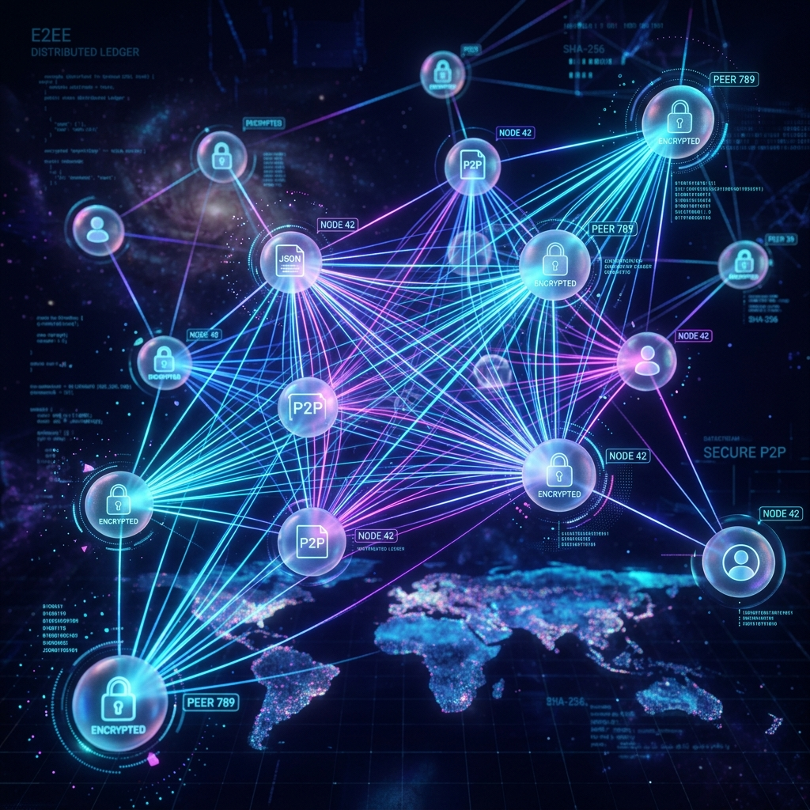

<div align="center">
  
  <h1>Nexly - Secure. Pure. Uncompromised.</h1>
  <p>The modern serverless, peer-to-peer encrypted social & chat platform.</p>
</div>

---

## ⚡ Overview

Nexly is a next-generation peer-to-peer (P2P) chat platform built on the principles of absolute privacy and ephemeral data. Unlike traditional messaging apps, Nexly uses **Zero Backend Servers** for data storage. All your messages, contacts, and profile data live purely in your browser's local storage (IndexedDB).

### 🚀 Key Features

- **Peer-to-Peer Communication:** Direct connection between users using WebRTC.
- **End-to-End Encryption:** Your messages are encrypted using AES-GCM and WebCrypto. Keys never leave your device.
- **Serverless Architecture:** Utilizes public MQTT brokers for lightweight user discovery, but drops the reliance on centralized database storage.
- **Local Persistence:** Your identity and chats are stored securely in IndexedDB and wiped when you sign out or clear your cache.
- **Modern UI/UX:** Built with React, Tailwind CSS, Framer Motion, and a stunning Glassmorphism dark mode aesthetic.
- **Real-Time Typing Indicators:** Know exactly when the other person is typing in a chat!

## 🛠️ Technology Stack

- **Framework:** React 18 + Vite + TypeScript
- **Styling:** Tailwind CSS + Framer Motion
- **State Management:** Zustand
- **Networking:** PeerJS (WebRTC) + MQTT.js (HiveMQ)
- **Database:** IndexedDB (idb)
- **Icons:** Lucide React

## 📦 Getting Started

### Prerequisites
- Node.js (v18+)
- NPM or Yarn

### Installation

1. Clone the repository:
   ```bash
   git clone https://github.com/your-username/nexly.git
   cd nexly
   ```

2. Install dependencies:
   ```bash
   npm install
   ```

3. Start the development server:
   ```bash
   npm run dev
   ```

4. Build for production:
   ```bash
   npm run build
   ```

## 🔒 Privacy Architecture

Nexly is "Privacy-First" by design. 
1. **Authentication:** There is no traditional registration. You generate an ECDH cryptographic identity locally on your device.
2. **Discovery:** When you enter the "Discover" tab, your public profile (username, bio) is broadcasted temporarily over a public MQTT topic. 
3. **Connection:** When you initiate a chat, a WebRTC handshake begins. All subsequent chat data is transmitted directly to the recipient over a secure DTLS-SRTP tunnel.

## 🤝 Contributing

Contributions are welcome! If you find bugs or want to add new features (e.g., file sharing over data channels, video calls), feel free to open a Pull Request.

## 📜 License

MIT License
